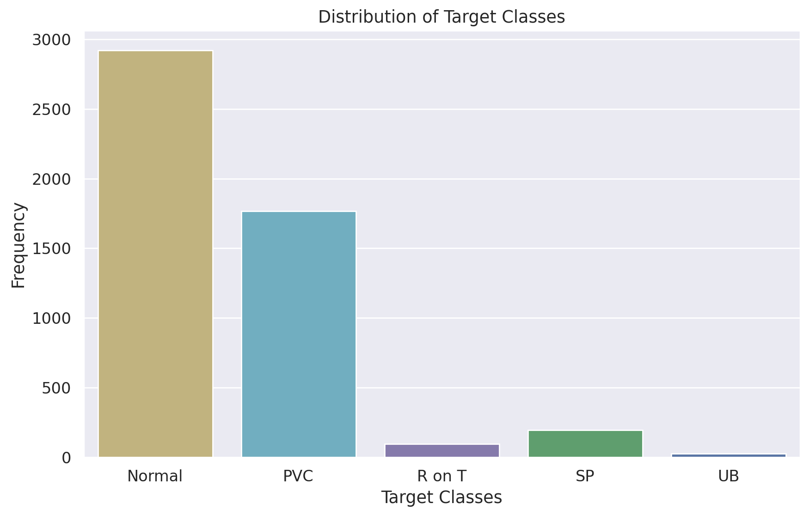
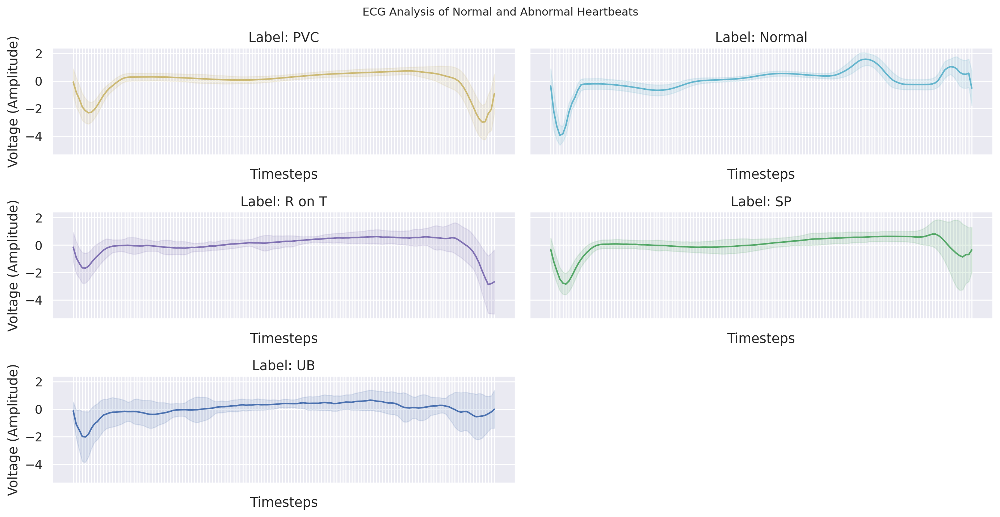
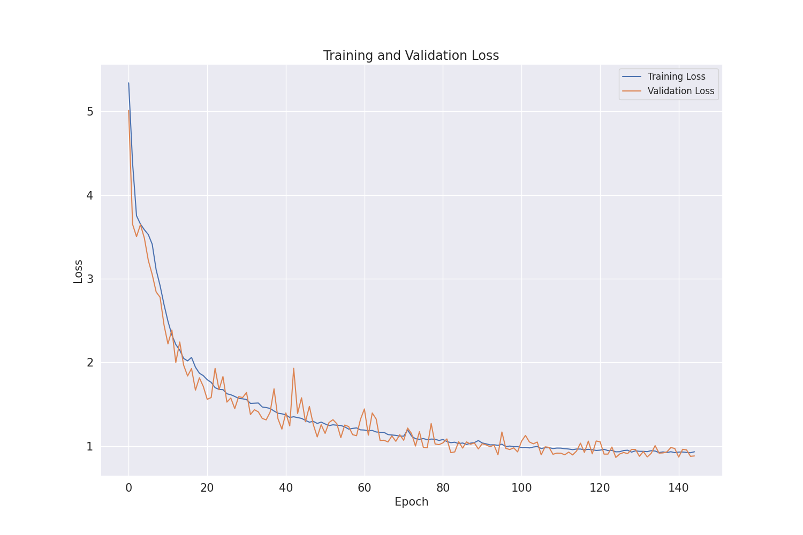
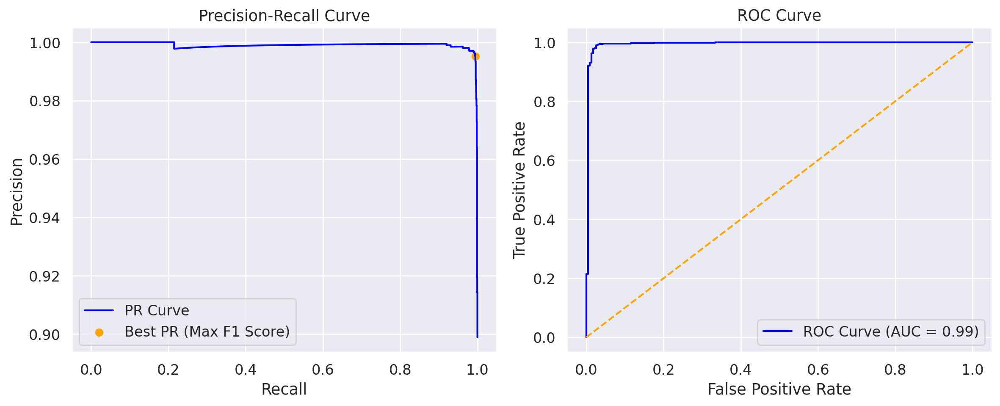
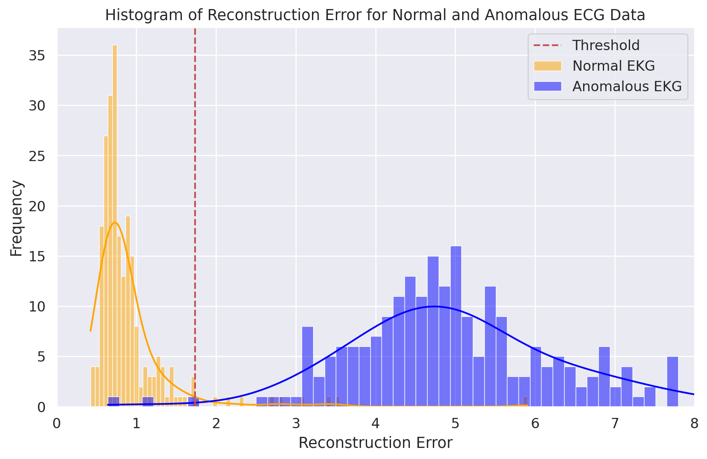
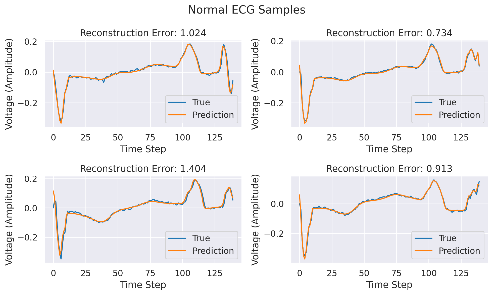
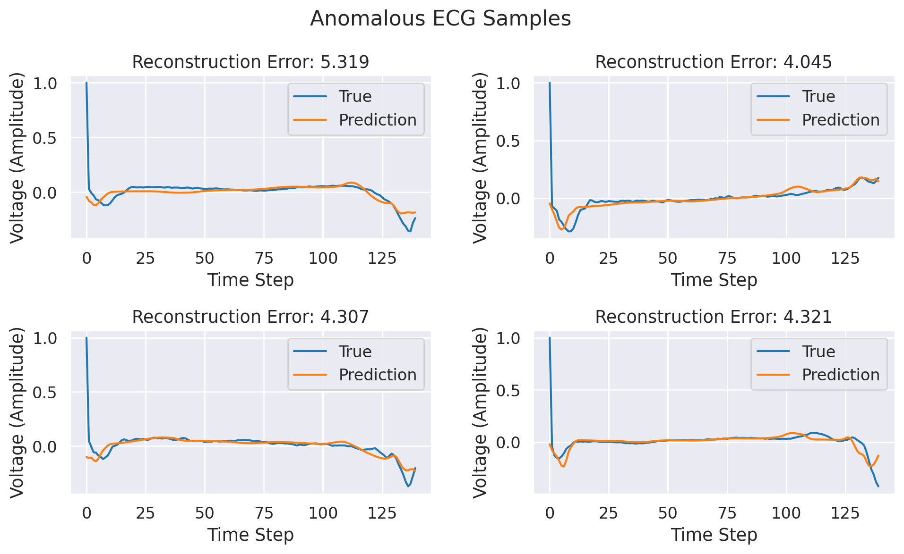

# Anomaly Detection on EKG Data using LSTM Autoencoder

## Project Description

This project implements an LSTM Autoencoder to detect anomalies in EKG (electrocardiogram) data. The goal is to identify irregular heartbeats (arrhythmias) by training an unsupervised model on normal EKG signals and detecting deviations that indicate anomalies. LSTM (Long Short-Term Memory) networks are well-suited for time series data, making them ideal for this type of sequence-based anomaly detection.

## Features

- Unsupervised anomaly detection on EKG data
- LSTM Autoencoder architecture designed for time series data
- Identifies irregular heartbeats, helping to detect potential arrhythmias
- Customizable training and inference scripts for your own EKG datasets

## Dataset and Class Distribution

The dataset used in this project contains labeled EKG signals divided into normal and abnormal classes. Below is the distribution of the classes:

- **Class Distribution:**

    

- **Sample Images:**

    

## Performance

The performance of the LSTM Autoencoder model is measured using several evaluation metrics. The following visuals summarize the model’s performance:

- **Training and Validation Loss:**

    

- **PR and ROC Curve:**

    

- **Anomaly Detection Threshold Selection:**

    

- **Reconstruction Loss on Normal and Abnormal EKGs:**

    - Normal EKG Reconstruction:

        

    - Abnormal EKG Reconstruction:

        

These visuals illustrate the loss during training and validation, the model's precision-recall and ROC curves, threshold selection for anomaly detection, and the reconstruction performance of the model on both normal and abnormal EKG signals.

## Contributing

If you'd like to contribute to this project, please follow these steps:

1. Fork the repository
2. Create a new branch (`git checkout -b feature/YourFeature`)
3. Make your changes and commit them (`git commit -am 'Add new feature'`)
4. Push your branch to GitHub (`git push origin feature/YourFeature`)
5. Create a Pull Request

## License

This project is licensed under the [MIT License](LICENSE). For more details, please refer to the license file.

## Contact

For questions or feedback, you can reach me at:

- Email: [1tunadogan@gmail.com](mailto:1tunadogan@gmail.com)
- GitHub: [1tunadogan](https://github.com/1tunadogan)
